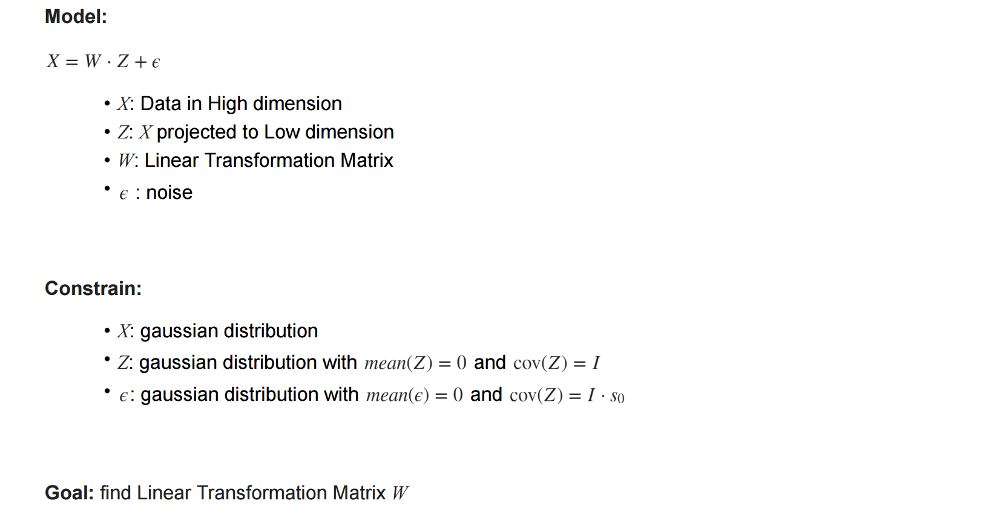
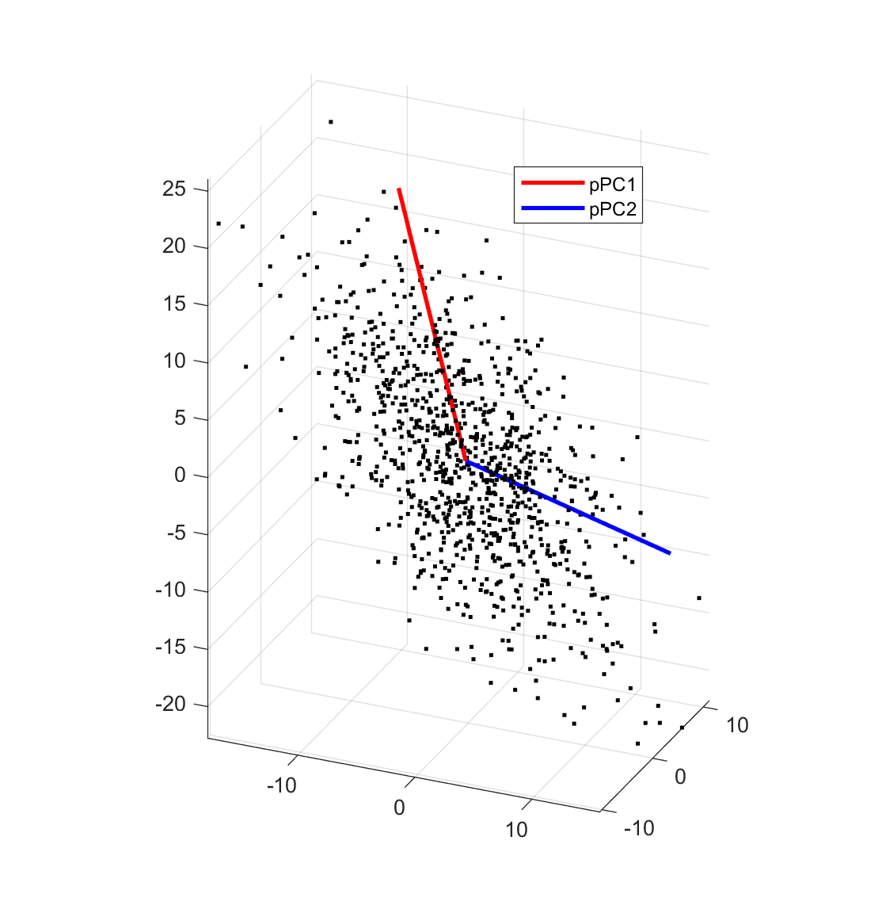
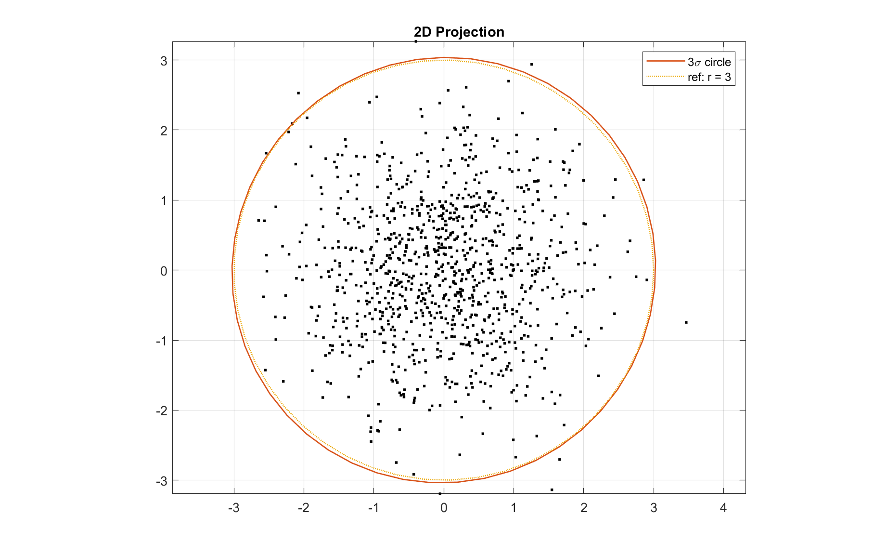

# pPCA-2D-3D-Demo
 Probabilistic principal component analysis

Use 3D point to 2D points as an example, explain what pPCA do.

Detail see <u>pPCA_3D_2D.pdf</u>

 

3D Points:

Project to pPCA Basis:

